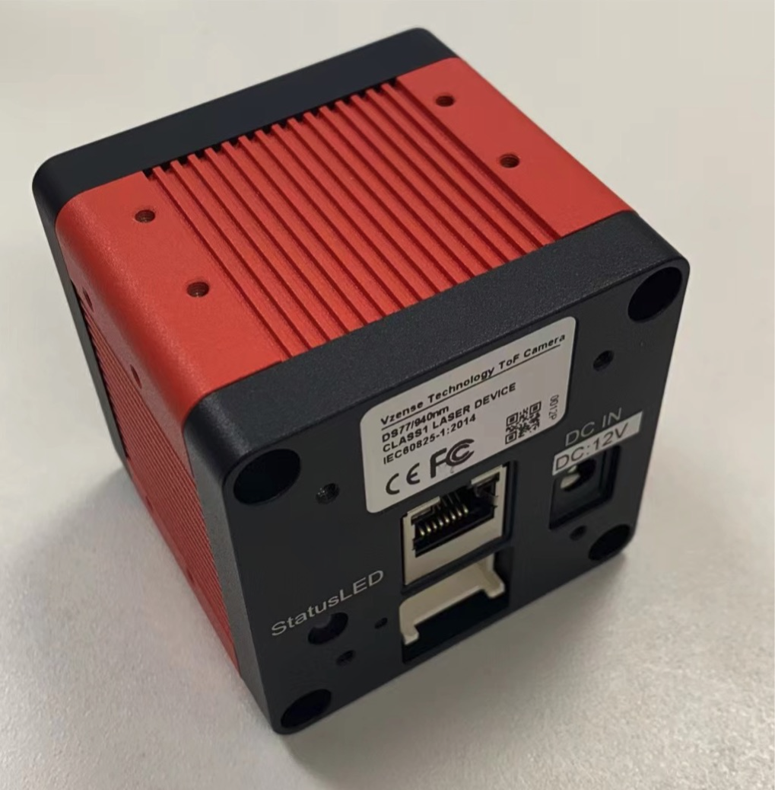
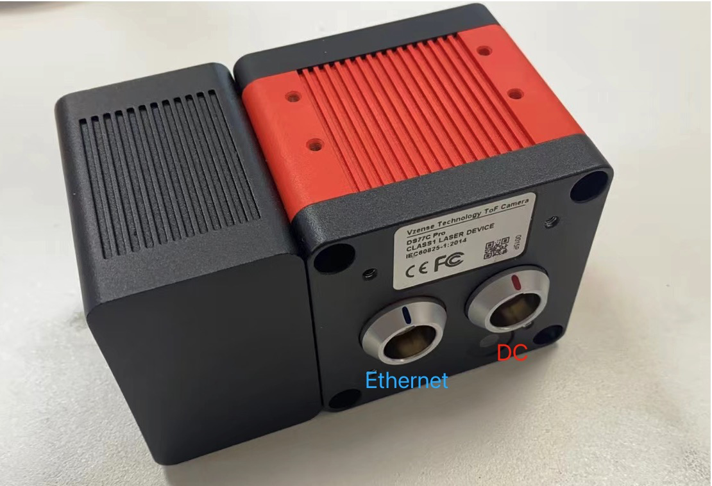
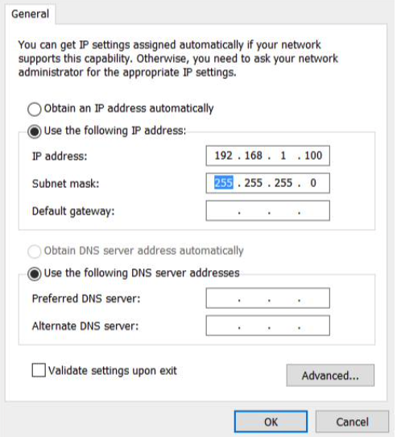
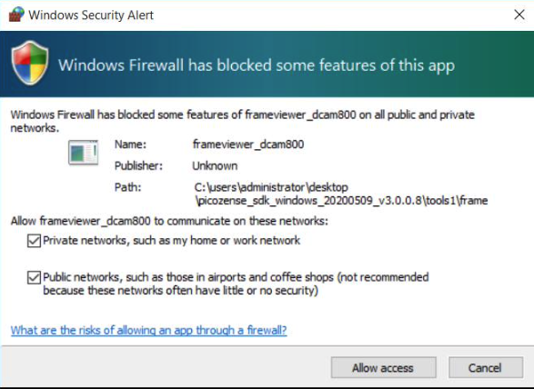
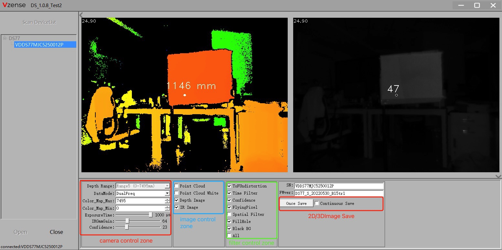
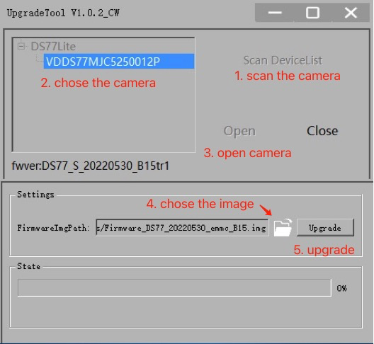
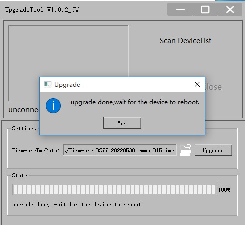

# DS77 Simple Guide

## 1 Download & Installation

Download or clone the DS-Tools from our GitHub / Gitee:

https://github.com/Vzense/DSTools

https://gitee.com/Vzense/DSTools

The Tools repo have three parts:

- VzenseDSUTool

  Display the 2D or 3D image of DS77 

- VzenseDSUpgradeTool

  Used for upgrade DS77 camera firmware 

- VzenseDSConfigTool

  Configurate the DS77 camera default parameter

------

## 2 Camera Setup

DS77 camera have two type: DS77-Lite and DS77-Pro.

The ports of DS77 is like below:

DS77-Lite

DS77-Pro

The steps are as below: 

1. Mount the camera in an appropriate fixture, e.g. a camera bracket; 
2. Connect the DS77 ToF camera to the host processor with the Ethernet cable(Direct connection);
3. Insert the DC connector of the power supply adaptor into the 12V DC Jack at the back of the camera; 
4. Connect the adaptor to power source; 
5. Please set the IP address of the camera and host PC in the same segment; 

Direct connection: 

One end is connected to the camera, and the other end is connected to the network cable interface of the PC host. The default IP of the camera is 192.168.1.101. On the PC side, set the subnet mask of "local connection" to 255.255.255.0, and the IP address to the same network segment (such as 192.168.1.100).

## 3 DSUTool

Follow the below steps to use DSUTool:

1. Set up the camera module as described above in Section 2.

2. Wait for the front of the camera to light up.

3. Navigate to the root of the **VzenseDSUTool** package and run **VzenseDSUTool.exe**;

4. Set permissions for the SDK to passthrough the system firewall, when you first run the Tool;

5. Click **Scan DeviceList** to find the camera;

6. DoubleClick the Camera Info in the devicelis or Click the Camera Mode first, then click **Start** in

   DSUTool to begin stream capture

**Camera control Zone**

Depth Range: Display the detect range

DataMode: the DualFreq is the default mode, use 120M/20M.

Color_Map_Max/Min:  change the color map in depth image show

ExposureTime: adjust the exposure time, the maxiume is 1000us

IRGmmGain: adjust the digital gamma gain of IR image, the value range is 0-255

Confidence: adjust the effect of confidence filter 

**Image control Zone**

Enable/Disable the Image window

**Filter control Zone**

Enable/Disable the Image filters

**2D/3D Image Save**

Once Save: save the current image of showing once

Continuous Save: Continuous save the showing image when enable it

 

## 4 DSUpgradeTool

Follow the below steps to use DSUpgradeTool to upgrade the firmware of DS77:

1. Set up the camera module as described above in Section 2.
2. Wait for the front of the camera to light up.
3. Navigate to the root of the **DSUpgradeTool** package and run **DSUpgradeTool.exe**;
4. Set permissions for the SDK to passthrough the system firewall, when you first run the Tool;
5. Click **Scan DeviceList** to find the camera;
6. Open and Connect the camera
7. chose the correct image file 
8. Click Upgrade and wait it success

